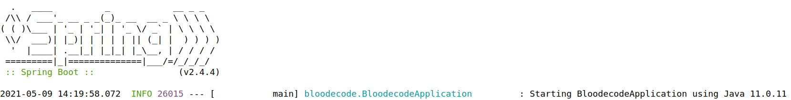

## User manual ##

Upload Bloodecode.jar and codefile.csv from Releases. In order to run the app, codefile.csv needs to be in the same folder as Bloodecode.jar.
Database files are created by the app itself.

Cd to the directory where the jar is and run
```
java -jar Bloodecode.jar
```
Alternatively, clone the repository, cd to the Bloodecode directory and run 
```
mvn spring-boot:run
```
The user interface is vey simple: 




Commands (0-6) are given by writing them in the terminal. If you give an invalid command, the app will tell you. 
When starting, the program will print the blood test items that it supports. Commands 1-2 are for searching information
about these items. When searching, use the appreviations given in the list. The case of letters does not matter. If you
search for an item that is not supported, the app will tell you.

  

Commands 3-6 are for the user's own notes. Notes will be stored in an in-memory database. In practice, if the app will
be used for monitoring one's own blood test results, database should be changed to a persistent one. Description of
the monitered item and the needed actions are free-form, but value (your value from blood test results) must be a number
-- otherwise a dummy value will be used.


For commands 4 and 6 you need the key of your note. If you don't remember the key, you can list your notes:


You may exit from the program with command 0.

<img src="Pictures/shutdown.png" /<
