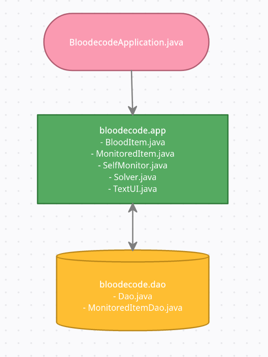
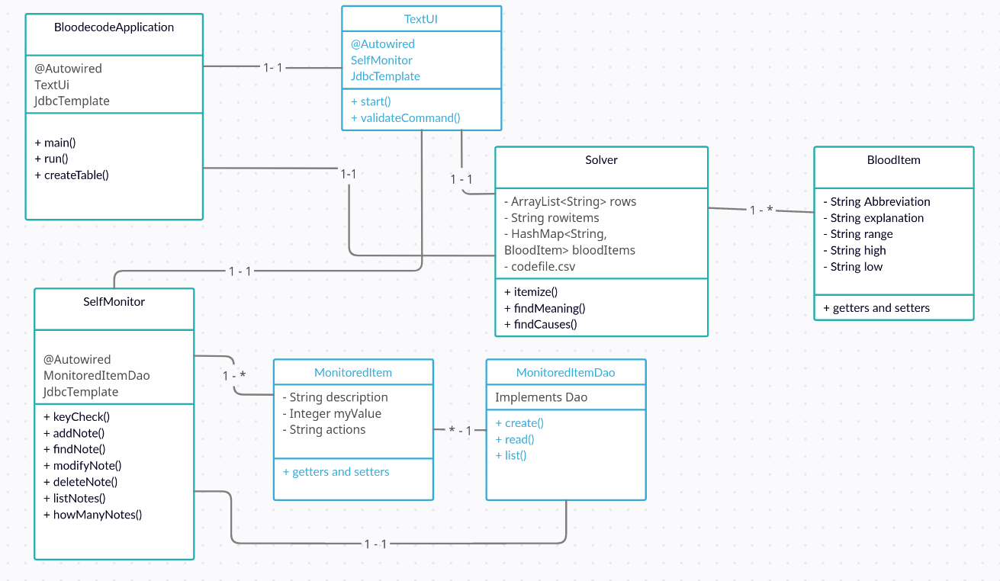
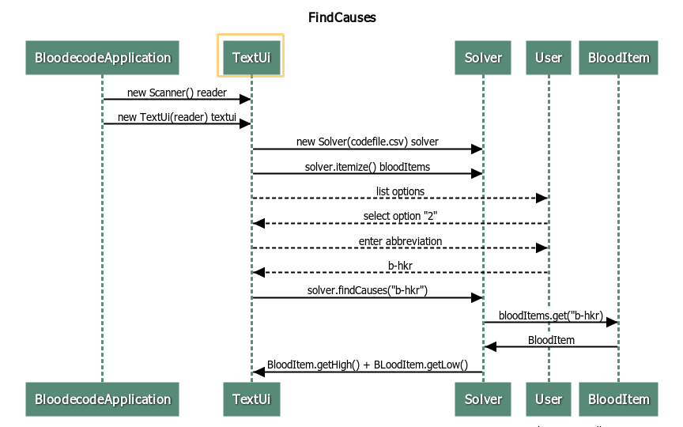

## Architecture ##

### Structure ###

The application has classes in three layers. Class BloodecodeApplication is located at the root of the project because it contains the main class and
@SpringBootApplication annotation. This starts component scanning for Spring Boot app.

Package bloodecode.app includes basic functionality of the app, while package bloodecode.dao holds the interface for accessing database.



### User Interface ###        

Currently the app does not have a graphic user interface. This is due to the difficulty of combining JavaFx 11 with Spring Boot. User uses the app by 
writing commands into the TextUi console.

Ui passes the commands given by the user to the responsible class as method parameters. TextUi does not have any methods of its own, apart from one for
validating basic commands.

Class diagram:



### Informative functions ###

Data concerning basic blood tests is saved in a csv file from which the application reads it. New information can be added by modifying codefile.csv
file. The data is read and converted into BloodItem objects when the application starts. For converting rows into objects, it is important that all
variables are separated with a semicolon in the csv file:
```
E-MCV;mean corpuscular volume of red cells;82–98 fl;iron deficiency anemia, thalassemia;vitamin B12 or folate deficiency, liver disease, alcoholism, hypothyroidism
E-RDW;red blood cell distribution width;women below 15 %, men below 14 %;small red blood cell count;vitamin B12 or folate deficiency, liver disease, hemolytic anemia
```
User can search for information based on abbreviations that appear in blood tests. Sequence diagram for finding causes for abnormal values:



### Saving of Data ###

The app uses Data Access Object model for manipulating database. The class responsible for handling user's notes -- MonitoredItems -- is SelfMonitor.
When the app starts, the run() method calls SelfMonitor's createTable() method for creating an in-memory database and a table called Monitor.
When user wants to insert, delete or list notes, MonitoredItemDao acts as an interface between SelfMonitor and database. Sequqence diagram for adding
a note:


Details for connecting to the database are saved in application.properties file.

### Issues with the application structure ###

User interface is probably not the only part of the application that could be improved. Currently, responsibility for validating user's commands lies 
almost completely on TextUI class. SelfMonitor has a function for checking that the given database key is valid but refactoring other checks seemed
too complicated. This is because TextUI needs to ask for a new command in case the given command is not approriate. So, most of the methods assume that
the parameters they are given are already in the correct form and testing incorrect parameters is not even applicable.

User might also appreciate a possibility to give their own names to the database and table. At present, the names are hard-coded. TextUI.start()
method can also be considered too long (67 lines). Each command could have been refactored to be a method on their own.


