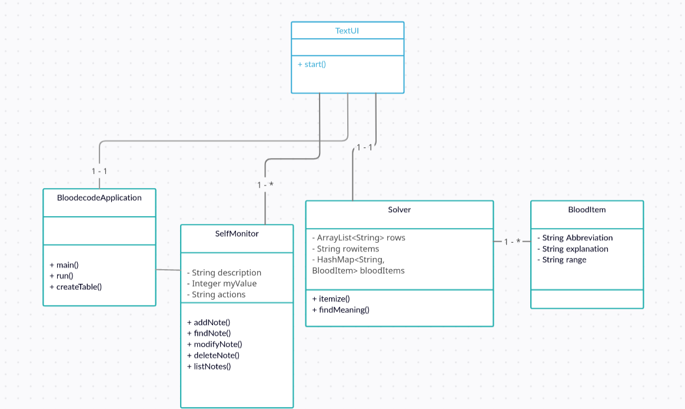

## Architecture ##

### Structure ###

The application has classes in three layers. Class BloodecodeApplication is located at the root of the project because it contains the main class and
@SpringBootApplication annotation. This starts component scanning for Spring Boot app.

Package bloodecode.app includes basic functionality of the app, while package bloodecode.dao holds the interface for accessing database.

### User Interface ###        

Currently the app des not have a graphic user interface. This is due to the difficulty of combining JavaFx 11 with Spring Boot. User uses the app by 
writing commands into the TextUi console.

Ui passes the commands given by the user to the responsible class as method parameters. TextUi does not have any methods of its own.

Preliminary class diagram of the app (to be updated!):

### Saving of Data ###

The app uses Data Access Object model for manipulating database. The run method calls another method for creating an in-memory database when the app
starts. When user wants to insert, delete or list notes, MonitoredItemDao acts as an interface between SelfMonitor and database.

