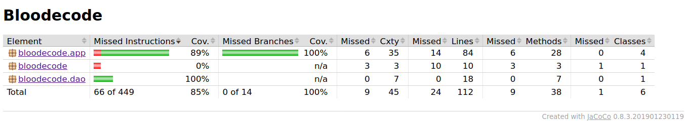

## Testing report ##

The application was tested with JUnit4 and test coverage report was generated with Jacoco Maven plugin. 
With TexUI excluded, the app has 85 % test coverage and 100 % branch coverage.



With no previous experience in testing a Spring Boot project, testing turned out to be much
more complicated than anticipated. Issues related to testing took about 60 % of the time 
spent on Bloodecode project.

The application has three classes -- BloodItem, Solver and MonitoredItem -- which are not Spring
components and could, therefore, be tested with normal JUnit tests. Test coverage for these classes
is not 100 % but testing all getters and setters didn't seem vital for the application. It was noted,
though, that removing setters from MonitoredItem class led the database to return null objects 
instead of MonitoredItems.

Challenges arose with classes with autowired dependencies and, especially, when trying to test
database operations. Tests annotated with @SpringBootTest were tried but it didn't seem 
sensible to load the whole application for testing a single class. Many other testing approaches
were also tried.

The final application has unit tests running with MockitoJunitRunner and uses mocks for
injecting dependencies. Mocks eliminate the need for manipulating database during testing. 
Since mocks are not real classes, each mock needs to be told what it is supposed to do. This 
seemed laborious at first, but the approach even made testing void methods possible.

As advised by course instructors, TextUi class is excluded from the test coverage report. However, TextUi does some error 
checking of its own by validating commands given by user. This means that methods of other classes don't need to be prepared
for incorrect parameters. For example, a test for SelfMonitor's method addNote(String description, double value, String actions) 
would not pass if the given value is not a double. However, TextUI will check if the given parameter is a number and parse it 
into a double. Ideally, classes should work fine in isolation. But that kind of a structure would have meant testing same 
thing several times.

After starting using Mockito, jacoco test coverage report did not update when running mvn
jacoco:report. However, running 
```
mvn clean test
```
before generating the report cleared the issue.

Testing the BloodecodeApplication class was tried, with mocks and without, but no sensible solution was found.
Therefore, the app class lowers the test coverage a bit.

The functions mentoned in requirementSpecification were tried with different types of input.
All commands mentioned in README.md were tested with jar file.

The application was written on a Linux device with Ubuntu 18.04 (University of Helsinki Cubbli distribution).
Jar (6th week version) was downloaded from Github and tried on a Windows 10 device. Unsurprisingly, the application
did not run because the device had Java 8 installed. However, course requirements did not expect the app to work on
a Windows device or with Java 8.
